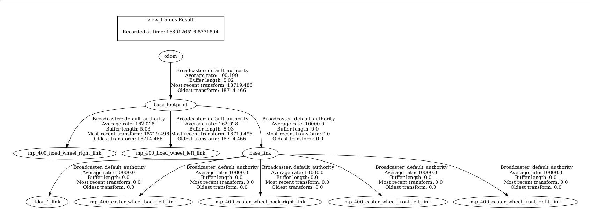
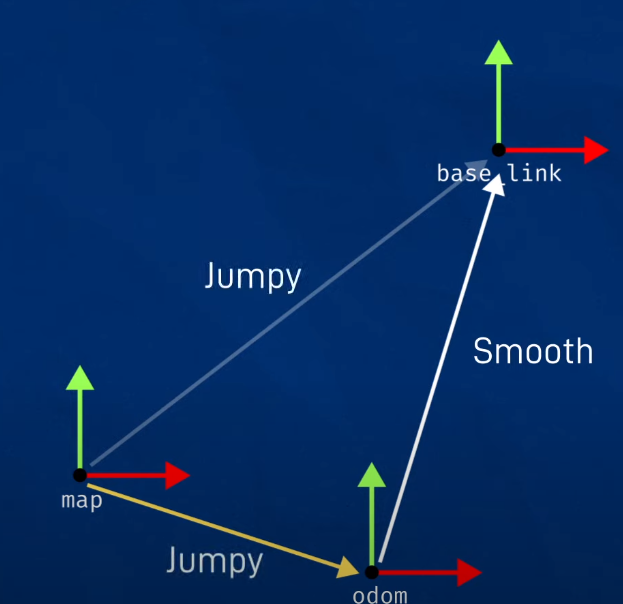

# Tranforms for slam_toolbox

The SLAM toolbox needs few specific transformations with the TF tree looking like:



However, the above picture was taken from simulation where multiple links were shown. We will
only worry about the following frames:

```
├── odom
│   ├── base_footprint
|       ├── base_link
|           ├── lidar_1_link
```

The below frames I'm guessing is necessary only during initialization of slam_toolbox node.
This is becasue the slam_toolbox is meant to publish it's own map frame as well. However for
**some weird stupid reason** it needs this map -> lidar_1_link as well.
```
├── map
│   ├── lidar_1_link
```

## Motivation

- odom frame is just our **initial robot pose** which is instantiated the moment we start
    the robot
- base_footprint frame is necessary to map where the robot would lie w.r.t the ground plane
    - Since our robot moves only in 2D, it would always stick to the ground plane
- base_link is the body frame of the robot. Since we move in 2D base_link = base_footprint
    - Since base_link = base_footprint, we use a static transform of 0 rotation and 0 translation

- odom -> base_footprint has to be updated by whichever node is publishing odometry information
- Since we are currently using LIDAR odometry, the base_link = lidar_1_link and is therefore
    another 0 rotation and 0 translation transform

## Interfacing with slam_toolbox

The slam_toolbox utilizes the above existing TF tree and when it's running it should look like
below:

```
├── map
|    ├── odom
│       ├── base_footprint
|           ├── base_link
|               ├── lidar_1_link
```

- As we move the robot around, the odom -> lidar_1_link transform will get continually updated
even without the slam_toolbox.
- However, it's the job of the slam_toolbox to correct the map -> lidar_1_link frame and thereby
    also correct the odom frame.
- A simple explanation is present in the starting part of this [video](https://www.youtube.com/watch?v=ZaiA3hWaRzE&t=1033s&ab_channel=ArticulatedRobotics) and a small vizualization is shown below:

